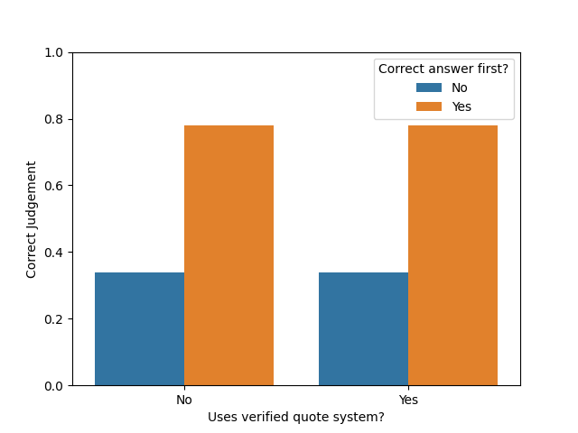

# Are LLMs really that gullible? - Investigating debate with a quote verification system

*This study examines the impact of quote verification systems on debates between Large Language Models (LLMs).*
*Using the QuALITY dataset and GPT-4o-mini, LLM debate systems are compared with and without quote verification, finding no visible change in debate outcomes.*
*However, a strong position bias is observed, with first positions consistently receiving more favorable judgments.*
*The results suggest that the effectiveness of quote verification in LLM debates may depend on model capability, and that biases in the prompt structure need to be addressed in debate system design.*
*The findings contrast with previous research and highlight the importance of considering model capabilities when implementing debate frameworks.*

## Introduction

Fact-checking in political debates has recently become popular. 
Either the facts are checked simultaneously during the debate or they are released in a different format after the debate.
I believe fact-checking has gained this popularity since politicians sometimes bend the truth a bit to further their cause.
Therefore, it is vital to validate the politicians' arguments for the viewer of the debate to better judge the statements fact-based.
If the viewers cannot trust the facts, what is their opinion then based on?

Debating is not only for people though. OpenAI researchers already have picked up on large language models (LLMs) debating with each other to improve their accuracy and trustworthiness.
This concept (then with a human judge) was introduced in 2018 in the paper "[AI safety via debate](https://arxiv.org/abs/1805.00899)".
The concept is that given a question two agents take turns in giving statements and a judge then evaluates which of the agents was giving the most true and helpful information.
With not only could the accuracy of a MNIST classification task be boosted, but also it is now more apparent for a person looking at the results how the AI came to its conclusion.
Hence, debate is not only useful for boosting the performance of AI models but also for transparency to improve the safety of these models.

With increasing capabilities of LLMs, they will surpass human expertise, posing as a problem for a human judge.
Which is why in the future humans will get the role of a non-expert overseeing expert AI models.
To anticipate this a recent follow-up paper on debate "[Debating with More Persuasive LLMs Leads to More Truthful Answers](https://arxiv.org/abs/2402.06782)" has investigated if weaker models can assess the correctness of stronger models.
In this paper, the models are made strong by providing information that in turn the weaker model does not have.

Within their experiments they implement a quote verification system.
The debating AI models are instructed to use quotes from the information provided to increase their trustworthiness.
These quotes are verified with a direct string match and then either flagged as verified or unverified.
With this quote verification the accuracy of the judge could be improved which raised a few questions for me to investigate.
Is it then actually similar to human debates that it is more difficult for LLMs to judge a debate without a fact-checking system like this?
Or more scientifically:

1. *How does the use of verified quotes influence the effectiveness of debates between LLMs?*
2. *What does this reveal about their susceptibility to persuasion?*

In order to investigate these questions, I started my own (smaller) investigation into the world of debating AIs.

## Methods

In order to be somewhat comparable to the aforementioned paper, the same dataset is used but not all the additions mentioned in the paper are added to the debate system.
For the dataset, the [QuALITY dataset](https://github.com/nyu-mll/quality) is used.
It is a question and answering dataset with long texts that are unlikely used in any LLM training.
Furthermore, the correct answer and the best distractor are annotated in the dataset.
This can then form the two opposing stances for the debate.
Therefore, it is excellent for assessing the debate capabilities of LLMs.
Like the original paper, the train and dev parts of the dataset are used with following filtering criteria:

1. 100% of untimed annotators chose the correct answer
2. Less than 50% of timed annotators chose the correct answer
3. All untimed annotators agree that the question is answerable and unambiguous
4. Average "context required" rating from untimed annotators is at least 1.5
5. Question writer label matches the gold label (correct answer defined by a majority vote)
6. Compatible with 2-answer requirement (e.g. no all/none of the above as answer)

This makes it compatible with the debate setting, but also challenging for the judge to discern the correct answer.
From this filtered question set, 100 are selected for the experiments with each the correct answer and the best distractor.

The quote verification system is a slightly relaxed version compared to only a direct string match.
Leading and trailing special characters and spaces are removed, before the quote is verified without case sensitivity.
This was necessary, since the debating agents not only put the quotes in <quote> tags as instructed, but also added quotation marks inside these tags.
This was not mentioned in the paper, but maybe was implemented anyway.
It could also be due to a smaller (, less capable) model that is used for these experiments.
For the debating agents and the judge GPT-4o-mini is used.

For the debate format, the prompts from the original paper are left almost the same.
The debating agents are explained the rules, encouraged to cite passages from the original text and the quote verification system explained if it is used.
They are also additionally instructed to first think step-by-step before formulating their final argument.
These thinking steps are then not displayed to the opponent or the judge but only the arguments themselves.
Additionally, differing from the paper no best-of-n answer selection was used.
Here, another LLM would select the best answer from multiple outputs for one debating step. 

Two experiments are done with one using no quote verification system and the other one does.
In order to counter the position bias of the answers, the judge judged the debate with both the correct answer and arguments first as well as the false first.
During the debate there are three rounds with different goals:

1. Initial statement of the agent
2. Highlighting flaws in the opponent's argument
3. Rebuttal against the critique of the opponent

After these three rounds of debate, the judge then selects and justifies which agent was more persuasive.
The entire implementation can be viewed in [this](https://github.com/AlmightyPeanut/AISFDebateProject) Github project.

## Results

The experimental outcomes revealed some unexpected results in how the quote verification influences (or does not influence) the debate process. 
These results are displayed in the figure below.
Overall, the system with quote verification actually performed similarly to the one without.
With the quote verification system 112 cases of 200 (100 question with swapping the debaters' arguments) are correctly classified compared to 115 without it.
In contrast to the original debate paper, the quote verification did not make a difference in the quality of the judge's assessments.

Even though the verification system does not seem to have an overall effect, there is some volatility in the details.
In total, 71 questions received different judgments between the two systems, highlighting how the verification system still could have impacted the debate dynamics.
In 37 (more than half) of these questions, the judge changed the opinion from the correct answer to the false answer and hereby worsening the outcome.
However, since the judge is not very good at discerning between the correct and false answer in general with an overall accuracy of 0.57, it can also be attributed to chance that the change in the input of the judge just randomly changed the output of the judge.
The overall accuracy can be attributed to the less capable LLM used in the experiments.

Since the quote verification system probably did not have an impact on the results, the position biased also mentioned in the paper was investigated additionally.
The experiments validated the significant factor of the position of the answers in the results.
When the correct answer was presented first, the verification system led to 78 correct judgments, compared to 75 without verification. 
However, when the correct answer came second, the numbers dropped to 34 and 40 correct judgments respectively. 

These results suggest that simple fact-checking mechanisms might not straightforwardly improve debate quality in the way one might intuitively expect for all LLMs. 
The strong position bias effect also raises important questions about the structure of the prompts for LLM debates and how prompt engineering can heavily influence results.
In the following, the described results are discussed.

## Discussion

The lack of impact from the quote verification system in these experiments presents an interesting contrast to the findings of the original study. 
While the original paper found that quote verification significantly helped the judge in discerning between the answers, the results presented here suggest this effect may not be universal across different model capabilities or debate contexts.
Several factors could explain this. 
First, the use of a newer however smaller and less capable model, compared to the original paper, could indicate that quote verification's effectiveness improves with model capability.
Less capable models might struggle to effectively utilize the verified quotes in their reasoning process, or may not fully comprehend their implications when making judgments.

The strong position bias observed in the results (with first positions receiving significantly more favorable judgments) suggests that the structure of the debate prompts or format could overshadow the potential benefits of using quote verification. 
This raises important questions about how debate frameworks should be designed to minimize such biases. 
The original study's use of best-of-n answer selection or their critique-and-refinement approach improved the judges accuracy and might have helped mitigate this bias.
However, they only mention the swap of arguments to selectively mitigate the positional bias.

Another notable observation is the overall lower accuracy rate (57%) compared to the original study (76%). 
This lower performance might indicate that the simplified implementation combined with a smaller model reached a different point in the accuracy-complexity trade-off. 
While the original paper demonstrated that more complex debate structures could achieve higher accuracy, our results suggest that simpler implementations might not capture all the benefits of debate-based approaches.

The volatility in judgments between verified and unverified conditions (71 questions receiving different judgments) indicates that the verification system did influence the debate dynamics, even if it didn't improve overall accuracy. 
This suggests that quote verification might be introducing noise rather than a clear signal into the decision-making process for less capable models. 
The fact that more than half of these changed judgments resulted in worse outcomes raises questions about whether verification systems need to be calibrated to the capability level of the models involved.

## Conclusion

In summary, these findings have some important implications for the development of AI debate systems:

**Model Capability Threshold**: 
There may be a minimum capability threshold that models need to reach before they can effectively utilize fact-checking mechanisms in debates. 
This suggests that debate system design might need to be tailored to the specific capabilities of the models involved.

**Bias Mitigation**: 
The strong position bias observed suggests that future debate frameworks need to incorporate explicit countermeasures against the structure of the prompt for simpler models. 
This might not only include randomizing positions, but e.g. developing new formats that minimize position effects.

Looking forward, these results suggest some interesting directions for future research. 
Investigating how quote verification effectiveness scales with model capability could help establish guidelines for when such systems are beneficial.
Additionally, developing new debate formats that naturally minimize position bias while maintaining the benefits of structured argumentation could improve the reliability of AI debate systems.
The apparent disconnect between the findings and the original study also highlights the importance of replication studies in AI research, particularly as we work with different model capabilities and simplified implementations. 
Understanding these differences can help build a more complete picture of how debate systems function across different contexts and capability levels.
